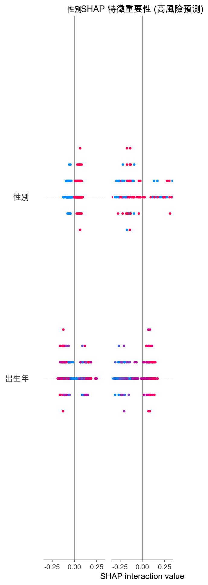

# Multivariate Analysis of Internet Usage Behavior and Cyberbullying Tendency

[](https://opensource.org/licenses/MIT)
[](https://www.crctaiwan.nctu.edu.tw/)
[](#methodology)
[](#interactive-dashboard)

> **[中文版 README](README_zh-TW.md)**

---

## Table of Contents

- [Abstract](#abstract)
- [Research Background](#research-background)
- [Data Description](#data-description)
- [Methodology](#methodology)
- [Key Findings](#key-findings)
- [Interactive Dashboard](#interactive-dashboard)
- [Project Structure](#project-structure)
- [Installation & Usage](#installation--usage)
- [Citation](#citation)
- [Author](#author)
- [License](#license)

---

## Abstract

This study employs multivariate analysis techniques to investigate the relationship between internet usage patterns and cyberbullying tendencies among Taiwanese adults. Using data from the **Taiwan Communication Survey (TCS) 2021** (N=672), we applied **Generalized Association Plots (GAP)**, **Principal Component Analysis (PCA)**, **Factor Analysis (FA)**, **Canonical Correlation Analysis (CCA)**, and **Machine Learning classification models** to identify distinct user groups and predictive factors.

<p align="center">
  
</p>

### Key Results

| Metric | Value |
|--------|-------|
| Distinct user clusters identified | **5 groups** |
| Best prediction model (AUC-ROC) | **71%** |
| Top predictor | **Age (39.7%)** |
| High-risk internet usage threshold | **>10 hours/day** |

---

## Research Background

### Research Questions

1. Can we identify distinct groups of internet users based on their behavioral patterns and demographic characteristics?
2. Which factors most strongly predict high cyberbullying tendency?
3. Can we develop an effective risk prediction model for early intervention?

### Research Gaps & Contributions

| Gap in Literature | This Study's Contribution |
|-------------------|---------------------------|
| Focus predominantly on adolescents | Extended analysis to adults aged 19-61 |
| Limited multivariate approaches | Comprehensive MVA framework integration |
| Lack of cross-generational analysis | Five-cluster typology across age groups |

---

## Data Description

### Data Source

**Taiwan Communication Survey (TCS) 2021**

- **Conducted by**: Research Center for Taiwan Communication, National Yang Ming Chiao Tung University
- **Sampling Method**: Stratified Three-Stage Random Digit Dialing (RDD)

### Sample Characteristics

| Attribute | Value |
|-----------|-------|
| Original Sample | 1,004 |
| Valid Sample | 672 |
| Features | 68 variables |
| Age Range | 19-61 years |
| Gender Ratio | Male 38.5%, Female 61.5% |

<p align="center">
  
</p>

<p align="center">
  
  
</p>

### Target Variable

**Cyberbullying Tendency Score** (Composite index derived from survey items)

| Statistic | Value |
|-----------|-------|
| Mean | 47.51 |
| Std Dev | 10.15 |
| Min / Max | 21.7 / 104.9 |
| Q1, Median, Q3 | 40.9, 46.45, 53.6 |

---

## Methodology

### Analytical Framework

```
┌─────────────────┐    ┌─────────────────┐    ┌─────────────────┐    ┌─────────────────┐
│   GAP Analysis  │ -> │  PCA / Factor   │ -> │    Canonical    │ -> │ Machine Learning│
│  (Clustering)   │    │   Analysis      │    │   Correlation   │    │   Prediction    │
└─────────────────┘    └─────────────────┘    └─────────────────┘    └─────────────────┘
      Group              Dimension              Variable Set           Classification
   Identification        Reduction              Relationships          & Explanation
```

### 1. Generalized Association Plots (GAP)

Employed binary GAP visualization to identify natural clusters in the data based on behavioral similarity matrices. This method reveals distinct user groups through heatmap diagonal patterns.

<p align="center">
  
</p>

### 2. Principal Component Analysis (PCA)

Extracted four principal components explaining **69.79%** of total variance:

| Component | Variance Explained | Interpretation |
|-----------|-------------------|----------------|
| PC1 | 31.58% | Exposure to negative online behaviors |
| PC2 | 18.25% | Tolerance for online conflict |
| PC3 | 12.12% | Behavior-attitude discrepancy |
| PC4 | 7.85% | Group diffusion effect |

<p align="center">
  
</p>

### 3. Factor Analysis (FA)

Identified four latent factors underlying cyberbullying-related constructs:

- **F1**: Online behavior norm perception
- **F2**: Bullying behavior manifestation
- **F3**: Negative impact awareness
- **F4**: Conflict tolerance

<p align="center">
  
</p>

### 4. Canonical Correlation Analysis (CCA)

Explored relationships between two variable sets:

- **Set 1**: Internet usage patterns (leisure time, work/study time, frequency)
- **Set 2**: Negative emotional indicators

**First Canonical Correlation**: r = 0.292 (p < 0.001)

### 5. Machine Learning Classification

Binary classification task: **High-risk** vs. **Normal** cyberbullying tendency

| Model | Accuracy | F1-Score | AUC-ROC |
|-------|----------|----------|---------|
| **Random Forest** | 73.3% | 0.500 | **0.709** |
| Logistic Regression | 68.2% | 0.506 | 0.706 |
| Gradient Boosting | 74.1% | 0.407 | 0.677 |
| XGBoost | 68.9% | 0.475 | 0.664 |
| LightGBM | 68.9% | 0.475 | 0.683 |

<p align="center">
  
</p>

### 6. SHAP Explainability

Applied SHapley Additive exPlanations (SHAP) for model interpretation, revealing individual feature contributions to predictions and enabling transparent decision-making insights.

<p align="center">
  
  
</p>

---

## Key Findings

### Cluster Analysis Results

| Cluster | Label | N | % | Mean Score | Mean Age | Risk Level |
|---------|-------|---|---|------------|----------|------------|
| 0 | General Female Group A | 133 | 19.8% | 46.02 | 39 | Medium |
| 1 | Heavy Internet Users | 73 | 10.9% | 50.32 | 32 | **High** |
| 2 | Low-Risk Elderly | 146 | 21.7% | 43.48 | 52 | Low |
| 3 | High-Risk Male Group | 182 | 27.1% | 51.08 | 39 | **High** |
| 4 | General Female Group B | 138 | 20.5% | 46.99 | 40 | Medium |

### Feature Importance (Random Forest)

| Rank | Feature | Importance | Category |
|------|---------|------------|----------|
| 1 | Age (Birth Year) | 39.66% | Demographic |
| 2 | Daily Internet Hours | 17.04% | Behavioral |
| 3 | Region | 14.16% | Demographic |
| 4 | Social Anxiety Level | 11.79% | Psychological |
| 5 | Education Level | 10.63% | Demographic |
| 6 | Gender | 6.72% | Demographic |

<p align="center">
  
</p>

<p align="center">
  
</p>

### Key Insights

1. **Age Effect**: Younger users (age < 35) exhibit significantly higher cyberbullying tendency scores than older cohorts
2. **Usage Intensity**: Users with >10 hours daily internet use show elevated risk profiles (Cluster 1: mean score = 50.32)
3. **Gender Disparity**: The male-dominated Cluster 3 demonstrates the highest mean cyberbullying tendency score (51.08)
4. **Behavior-Attitude Gap**: PC3 reveals a notable discrepancy between stated attitudes toward online behavior and actual behavioral patterns

---

## Interactive Dashboard

An interactive Vue.js dashboard is available for exploring the analysis results with modern visualization and smooth animations.

### Features

- **Single-page narrative design** - Scroll-based storytelling flow
- **Interactive visualizations** - Hover effects and dynamic animations
- **Responsive layout** - Mobile-friendly interface
- **GSAP animations** - Smooth scroll-triggered transitions

### Quick Start

```bash
cd dashboard
npm install
npm run dev
```

**Access**: `http://localhost:5173`

### Dashboard Sections

1. **Hero** - Research overview and key metrics
2. **Problem** - Research questions and methodology framework
3. **Data** - Dataset description and sample characteristics
4. **GAP** - Cluster analysis visualization and group profiles
5. **PCA** - Principal component structure and interpretations
6. **ML** - Model comparison and feature importance
7. **Conclusion** - Key findings and research contributions

---

## Project Structure

```
MVA-Cyberbullying-Analysis/
├── README.md                        # English documentation
├── README_zh-TW.md                  # Chinese documentation
├── images/                          # Analysis output figures
│   ├── GAP.png
│   ├── 主成分結構.png
│   ├── 因素分析結構.png
│   └── ml/
│       ├── classification_results.png
│       ├── rf_feature_importance.png
│       ├── shap_summary.png
│       └── shap_bar.png
├── ML/                              # Machine Learning scripts
│   ├── classification_model.py
│   └── shap_analysis.py
├── dashboard/                       # Vue.js interactive dashboard
│   ├── src/
│   │   ├── App.vue                 # Main component
│   │   └── data/
│   │       └── analysisData.js     # Data constants
│   ├── public/images/              # Static assets
│   └── package.json
└── data/                            # Raw data (not included)
```

---

## Installation & Usage

### Prerequisites

- Node.js >= 18.0
- Python >= 3.9 (optional, for ML scripts)

### Dashboard Setup

```bash
# Clone repository
git clone https://github.com/yourusername/mva-cyberbullying-analysis.git
cd mva-cyberbullying-analysis

# Install dependencies
cd dashboard
npm install

# Start development server
npm run dev

# Build for production
npm run build
```

### ML Analysis (Optional)

```bash
# Create virtual environment
python -m venv venv
source venv/bin/activate  # Windows: venv\Scripts\activate

# Install dependencies
pip install -r requirements.txt

# Run analysis
python ML/classification_model.py
```

---

## Citation

If you use this work in your research, please cite:

```bibtex
@thesis{hong2024cyberbullying,
  title     = {Multivariate Analysis of Internet Usage Behavior and Cyberbullying Tendency},
  author    = {Hong, Wei-Qi (TimWei)},
  year      = {2024},
  school    = {Tamkang University},
  department = {Department of Statistics, Master's Program in Data Science},
  type      = {Course Project},
  note      = {MVA Final Report}
}
```

---

## Author

**TimWei (Wei-Qi Hong)**

- **Program**: Master's Program in Data Science
- **Department**: Department of Statistics
- **University**: Tamkang University, Taiwan

---

## License

This project is licensed under the MIT License - see the [LICENSE](LICENSE) file for details.

---

## Acknowledgments

- **Data Source**: Taiwan Communication Survey (TCS), Research Center for Taiwan Communication, 
- **Course**: Multivariate Analysis (MVA), Fall 2024
- **Institution**: Department of Statistics, Tamkang University

---

<p align="center">
  <i>This research contributes to understanding cyberbullying behavior patterns for developing more effective prevention and intervention strategies.</i>
</p>
